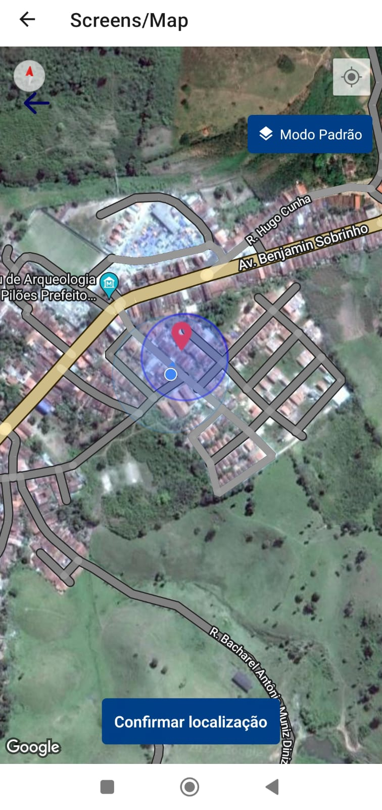
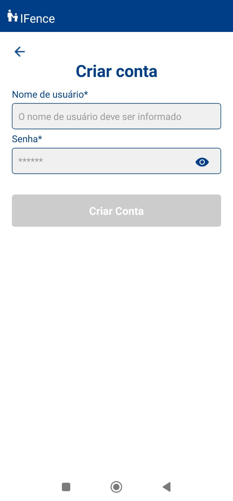
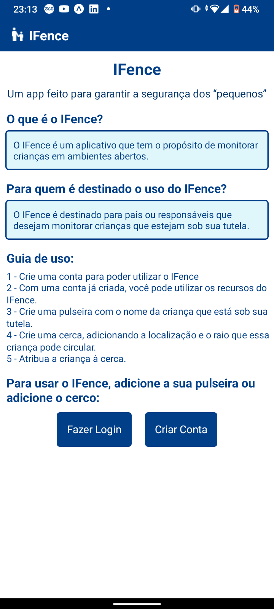

# IFence-mobile
O IFence é um aplicativo de monitoramento de crianças em ambientes abertos.

# Tecnologias Utilizadas
- React Native
- Expo
- AsyncStorage 
- React Native Maps

# Pré-Requisitos
- Node.js
- Expo CLI (se estiver usando Expo)
- Git
- Um emulador Android/iOS ou dispositivo físico(Opcional, o aplicativo Expo Go disponibliza um emulador)

# Instalação e Execução
Clone o repositório
```
git clone https://github.com/elenilsonvieira/ifence-mobile.git
```

Acesse o diretório do projeto
```
cd ifence-mobile
```

Execute o aplicativo
```
npx expo start # Caso esteja usando Expo
# ou
npx react-native run-android # Para Android
npx react-native run-ios # Para iOS
```
# Funcionalidades 
- Criação de pulseiras.
- Criação de cercas.
- Visualização de pulseiras e cercas.
- Monitoramento em tempo real de uma pulseira associada a uma respectiva cerca. 

# Telas do App
<p align="center">
  
  
  
  
  
  
  
   
</p>

# Considerações
Como em todo projeto, há coisas para melhorar. No app do IFence, há funcionalidades que precisam ser melhoradas e ajustadas. Abaixo, estão os pontos que precisam ser melhorados:

- Desenvolver uma API  e, consequentemente, realizar a persistência de dados em um SGBD, por exemplo: Postres, SQLite, MongoDB, etc. Como não tivemos tempo para desenvolver uma API, optamos por salvar os dados no AsyncStorage.
A pasta `storage` é responsável pela a persitência dos dados:
```
\cercaStorage.ts - responsável pela persistência dos dados referentes à cerca
\userStorage.ts - responsável pela persistência dos dados referentes ao usuário
```

- Alguns componentes precisam ser refatorados. Por exemplo, no componente `AdicionarPulseiraScreen.tsx`, toda lógica de CRUD está no componente, isso precisa ser estruturado em outros componentes. E também a própria persistência está no respectivo componente. 

- Nós utilizamos a biblioteca `react-native-toast-message` para exibir as notificações quando uma criança sai da área de uma respectiva cerca. A próxima equipe poderá optar em utilizar o `react-native-toast-message` ou `expo-notifications`[Expo notifications](https://docs.expo.dev/versions/latest/sdk/notifications/).

- Aprimorar a funcionalidade de atribuir mais de uma pulseira a uma respectiva cerca. Atualmente, o app permite apenas a atribuição de uma pulseira.

Contribuidores: [Lucas Acelino](https://github.com/lucasacelino), [Jonas de Lima](https://github.com/Jonaslima07) e [João Henrique](https://github.com/HenrIcosta16).


